# Stark Industries Virtual Private LAN Service

## Background

Stark Industries, a leading innovator in technology and engineering, is in need of a robust Virtual Private LAN Service (VPLS) to ensure seamless and secure communication across its corporate network. With its headquarters and two remote branches in located in Accra, the company requires an integrated network solution that supports its dynamic business operations and promotes efficient collaboration between teams.

The headquarters, as the central hub, houses the core data systems and critical applications that drive the company's operations. The remote branches, while geographically dispersed, play essential roles in the company's strategy, contributing to research and development, customer relations, and regional sales. To maintain operational continuity, secure data exchange, and enable effective teamwork, Stark Industries requires a VPL service that delivers high-performance connectivity and reliable security measures.

## Network Topology

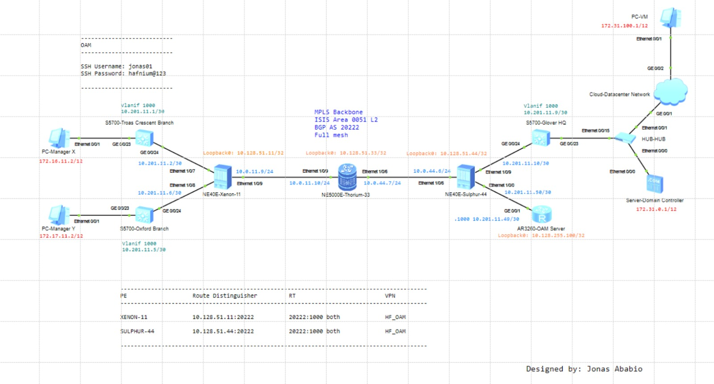

This lab involves the following devices:

- One server
- One AR3260 router
- Three S5700 switches
- Two NE40E routers
- One NE5000 router
- One hub
- Three PCs

### VLAN Plan

| Vlan | Instance type | Instance name | Description |
| - | :- | :- | :- |
| *999* | VSI | Stark-Industries | For forwarding Layer 2 packets based on MAC addresses and VLAN tags |
| *1000* | VPN | HF_OAM | For operations and maintenance i.e. remote access via SSH |

| Device name | Interface | Link type | VLAN plan | Description |
| - | :- | :- | :- | :- |
| *XENON-11* | Ethernet1/0/7 | - | dot1q: 999, 1000 | Link to Troas Crescent Branch |
|  | Ethernet1/0/8 | - | dot1q: 999, 1000 | Link to Oxford Branch |
| *SULPHUR-44* | Ethernet1/0/7 | - | dot1q: 1000 | Link to Hafnium NMS Server |
| | Ethernet1/0/9 | - | dot1q: 999, 1000 | Link to Glover HQ |
| *TROAS CRESCENT BRANCH* | GE0/0/24 | Trunk | allow-pass: 999, 1000 | Link to Xenon-11 |
|  | GE0/0/23 | Access | default: 999 | Link to LAN |
| *OXFORD BRANCH* | GE0/0/24 | Trunk | allow-pass: 999, 1000 | Link to Xenon-11 |
|  | GE0/0/23 | Access | default: 999 | Link to LAN |
| *GLOVER HQ* | GE0/0/24 | Trunk | allow-pass: 999, 1000 | Link to Sulphur-44 |
|  | GE0/0/23 | Access | default: 999 | Link to LAN |
| *HAFNIUM OAM SERVER* | GE0/0/1 | - | dot1q: 1000 | Link to Sulphur-44 |

### IP Address Plan

| Device name | Interface | IP Address | Subnet Mask |
| - | :- | :- | :- |
| *DOMAIN CONTROLLER* | Ethernet0/0/0 | 172.31.0.1 | 12 |
| *VM* | Ethernet0/0/1 | 172.31.100.1 | 12 |
| *SULPHUR-44* | LoopBack0 | 10.128.51.44 | 32 |
| | Ethernet1/0/6 | 10.0.44.6 | 24 |
| | Ethernet1/0/1.1000 | 10.201.11.50 | 30 |
| | Ethernet1/0/9.1000 | 10.201.11.10 | 30 |
| *TROAS CRESCENT BRANCH* | Vlanif1000 | 10.201.11.1 | 30 |
| *OXFORD BRANCH* | Vlanif1000 | 10.201.11.5 | 30 |
| *GLOVER HQ* | Vlanif1000 | 10.201.11.9 | 30 |
| *HAFNIUM OAM SERVER* | LoopBack0 | 10.128.255.100 | 32 |
| | GE0/0/1.1000 | 10.201.11.49 | 30 |
| *THORIUM-33* | LoopBack0 | 10.128.51.33 | 32 |
| | Ethernet1/0/6 | 10.0.11.10 | 24 |
| | Ethernet1/0/9 | 10.0.44.7 | 24 |
| *XENON-11* | LoopBack0 | 10.128.51.11 | 32 |
| | Ethernet/0/9 | 10.0.11.9 | 24 |
| | Ethernet1/0/7.1000 | 10.201.11.2 | 30 |
| | Ethernet1/0/8.1000 | 10.201.11.6 | 30 |
| *MANAGER X's PC* | Ethernet0/0/1 | 172.16.11.2 | 12 |
| *MANAGER Y's PC* | Ethernet0/0/1 | 172.17.11.2 | 12 |

For loopback 0 interfaces of NEs in the backbone - 10.128.51.X/32 where X is the NE ID
For point-to-point IPs in the backbone - 10.0.X.Y/24 where X is the NE ID of the provider edge router

## Configuration

### IP connectivity in the backbone

The IGP used is IS-IS and all routers are configured as Level-2 with AFI being 49 and Area ID being 0051. The system ID is generated based on the loopback 0 IP of the NE. Process 1 of IS-IS is used.
>NET example: 49.0051.1921.6801.1001.00
>
>IS-IS is enabled on Loopback0 and the P2P interfaces within the backbone.

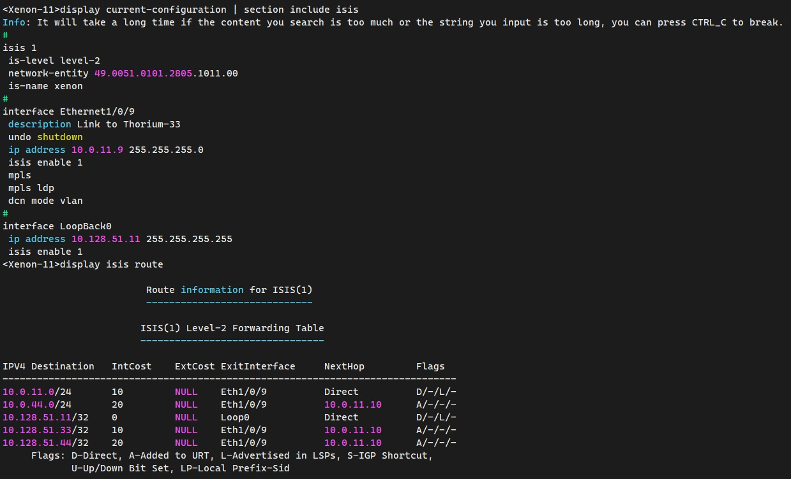

The EGP used is BGP with the autonomous system number being 20222. Since there are only 3 routers in the backbone, full-mesh is preferred for IBGP neighbor establishment.
>Router ID = Loopback0's IP
>
>Each router establishes a peer relationship via Loopback 0.
>
>The IP of Loopback 0 is advertised.

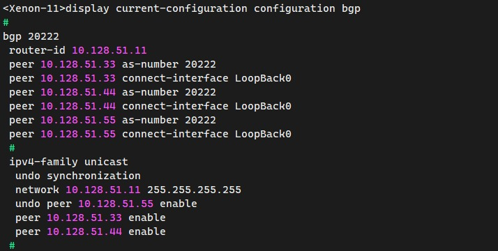

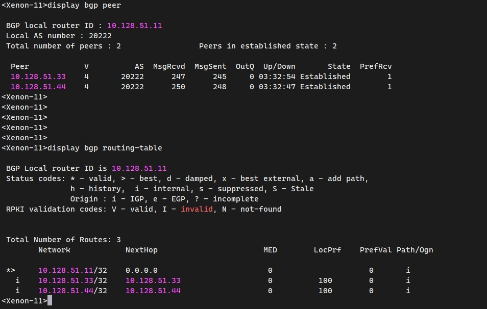

### Implementing MPLS within the backbone

This allows packets to be forwarded across the backbone using dynamic LSPs.
Loopback0 IPs are used as LSR-IDs

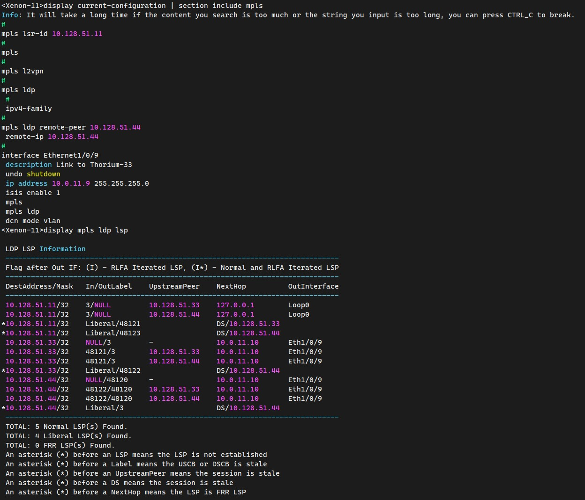

### Implementing MPLS L2VPN

VPLS defines an architecture that allows MPLS networks to provide layer 2 multi-point ethernet service. The MPLS backbone emulates an ethernet bridge/switch. (virtual switch)

VPLS is deployed with LDP signaling also known as Martini Mode.

>Virtual Switch Instance name: Stark-Industries
>
>Virtual Circuit Id: 999
>
>Pseudowire signaling: LDP

The remote peer is also indicated. VC-ID on the local PE and the remote PE are the same in order to establish the pseudowire status.

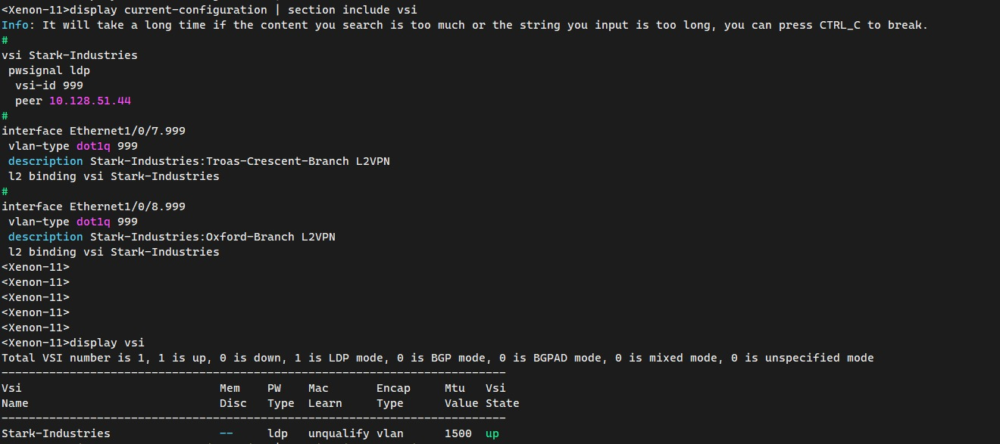

### Implementing MPLS L3VPN

Provider edge routers are the only routers within an MPLS domain that are allowed to maintain separate routing tables for each VPN using Virtual Routing and Forwarding (VRF).

PEs use route distinguishers to distinguish between routes from different VPN sites.

MPLS L3VPN (HF_OAM) is used for remotely accessing customer premises equipments. MPLS L3VPN uses BGP to advertise VPN routes. Since Xenon-11 and Sulphur-44 are the only PEs in the backbone, they establish an MP-IBGP peer via their LoopBack0 interface.

Direct and static routes will be imported into the MP-BGP instance to allow route exchage between the PEs and CEs.

| Provider Edge | VPN Instance | Route Distinguisher | Route Target |
| - | :- | :- | :- |
| **XENON-11** | HF_OAM | 10.128.51.11:1000 | 20222:1000 both import and export |
| **SULPHUR-44** | HF_OAM | 10.128.51.44:1000 | 20222:1000 both import and export |

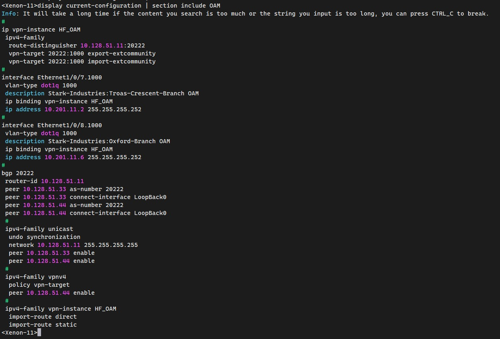

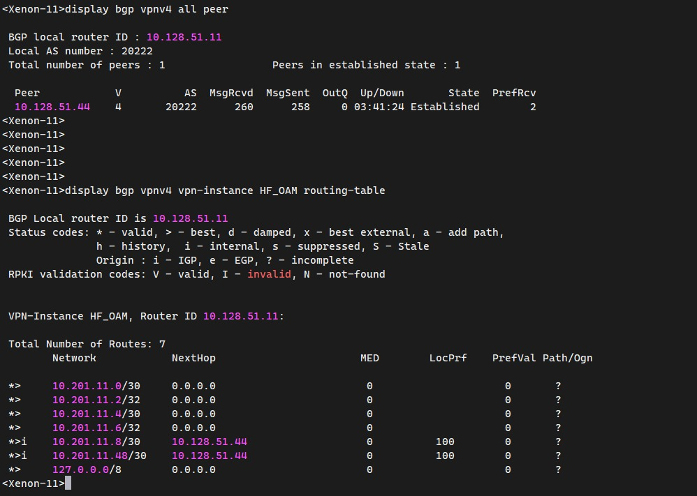

`P2P test from Sulphur-44 to the OAM Server`

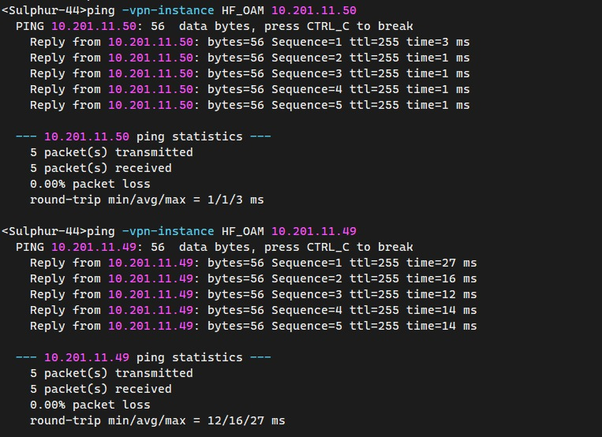

`All CPEs can be reached from the OAM server`

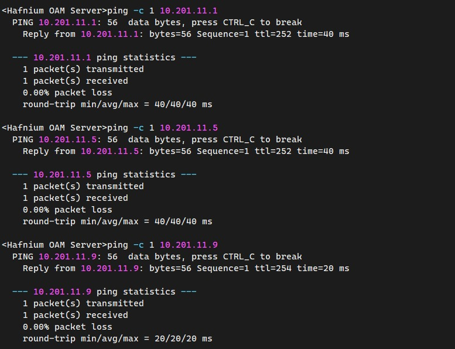

### Authentication, Authorization and Accounting

SSH authentication is enabled on the virtual terminal type (VTY) with a basic access control list that allows remote login from the 10.201.11.0/24 block.

SSH user is configured as `jonas01` with password `hafnium@123`

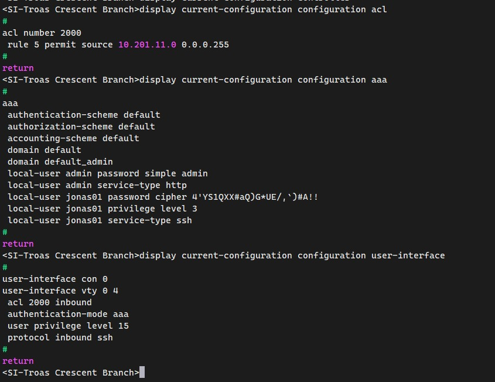

`Accessing the Troas Cresent CPE from the OAM Server`

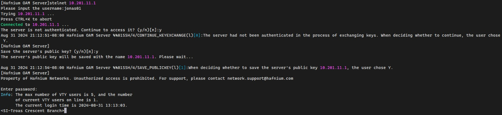

`Accessing the Troas Cresent CPE from Xenon-11`

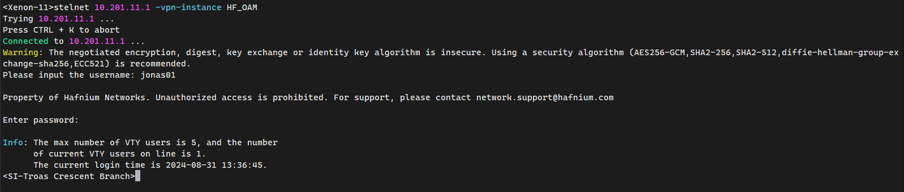

`Accessing the OAM Server via console`

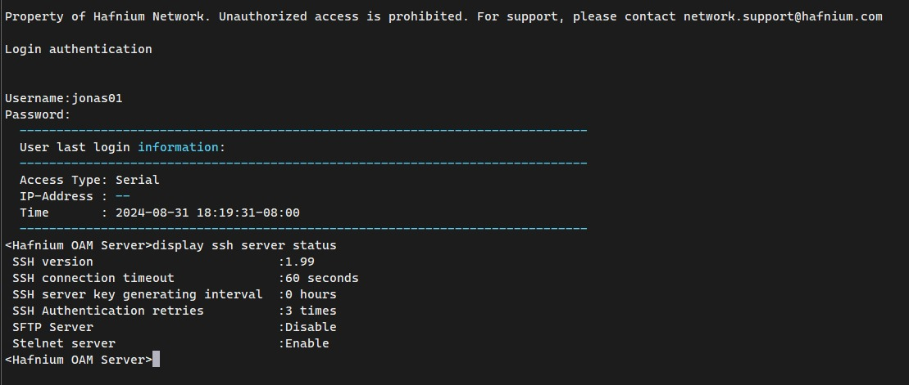

### Summary

`VPLS test between XENON-11 and SULPHUR-44`

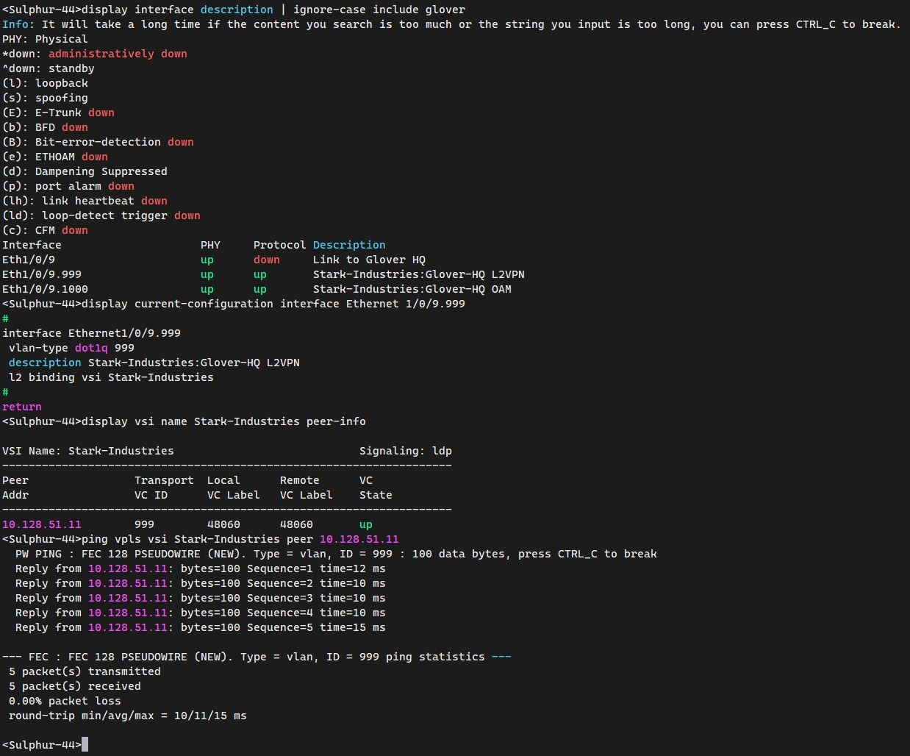

`Mac-address table on SULPHUR-44` shows that the mac-addresses of Manager X and Manager Y's PCs can be learnt via the L2 VC and the mac-address of the VM server can be learnt via the local attachment circuit.

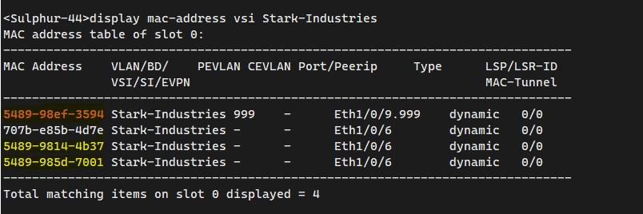

`Tests from Manager X's PC to the VM and domain controller`

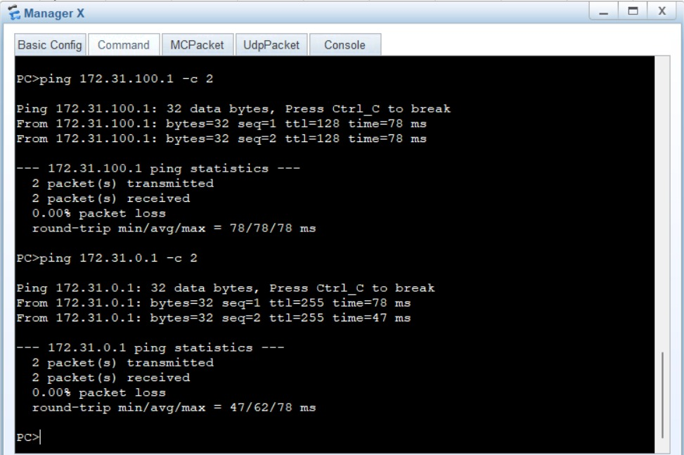
